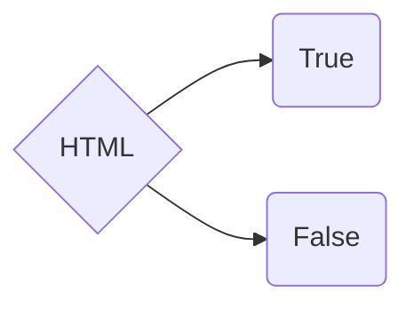
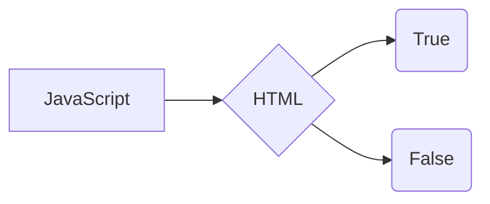

$$
\Gamma(z) = \int_0^\infty t^{z-1}e^{-t}dt\,.
$$
Expressions help us to conditionally render/display elements in markup

# Expressions in Aura
```html
<aura:if isTrue="{! (!v.attribute ? ifYes : ifFalse) }">
    <div>Conditional displayed elements/text</div>
</aura:if>
```

In Aura we can write expression as seen above, where as in lwc something like this is not possible to directly write in markup. We need write expressions in JavaScript and use their result in markup.

# Expressions in LWC
```html
<template>
    <div if:true={expression}>elements</div>
</template>
```
```javascript
import { LightningElement } from 'lwc';
export default class SampleComponent {
    get expression() {
        return condition ? true : false;
    }
}
```

> **`Note:`** In lwc **if:true** and **if:false** looks for boolean value either **true** or **false**


## AURA

## LWC


**References**
 - [Expressions in lwc](https://developer.salesforce.com/docs/component-library/documentation/en/lwc/lwc.migrate_expressions){:rel="nofollow"}{:target="_blank"}